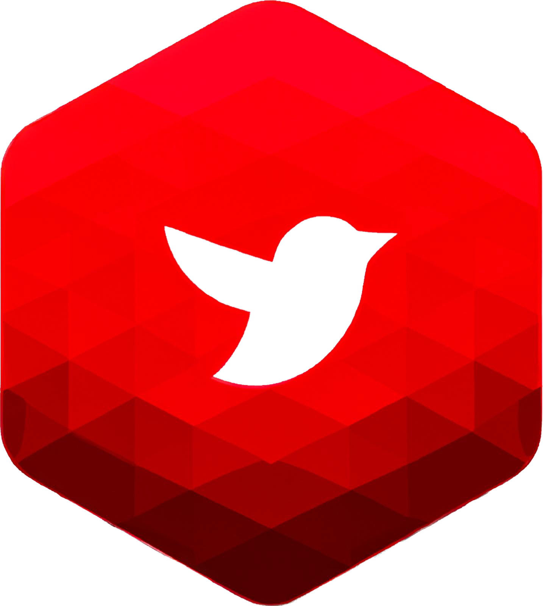

# InsultBlock Project



## 📖 Description
Smart insult detector on Twitter. Detection of insults, analysis of the repercussion of an insult on other comments of a tweet and visualization of insults of each user with statistics (max, min, average of insults per user according to some categories). Visualization planned on Dash

Détecteur d'insulte intelligent sur Twitter. Détection des insultes, analyse de la répercussion d'une insulte sur les autres commentaires d'un tweet et visualisation des insultes de chaque utilisateur avec des statistiques (max, min, moyenne d'insultes par utilisateur selon certaines catégories). Visualisation prévue sur Dash/Seaborn/Plotly et aussi WordCloud.

## 📦 Dependencies

First of all, you can install dependencies with:

```
pip install -r requirement.txt
```

## 📥 Installation
Le dépôt est codé en Python 3.10.6
L'installation doit être faite selon l'arborescence suivante:

```
.
├── README.md
├── credentials.py
├── insult_detector
│   ├── cas_particuliers.py
│   ├── detecteur_v1.py
│   ├── detecteur_v2.py
│   ├── detecteur_v3.py
│   ├── insult.txt
│   ├── main_detector.py
│   ├── sklearn_entrainement.py
│   └── train_data
│       ├── text_classifier
│       ├── train.csv
│       └── train2.csv
├── main.py
├── requirements.txt
├── tweets_analysis
│   └── stats.py
├── tweets_collect
│   ├── api_connection.py
│   ├── main_collect.py
│   ├── search_tweets.py
│   ├── to_dataframe.py
│   ├── to_json.py
│   └── twitter_candidate_data
│       ├── hashtag_candidate_n.txt
│       └── keywords_candidate_n.txt
├── tweets_data
│   └── data_test.json
└── visualisation_gui
    ├── Logo.png
    ├── main_dash.py
    ├── pages
    │   ├── dashboard.py
    │   ├── subject.py
    │   └── user.py
    └── word_cloud.py

```

## Support
Pas de support pour l'instant

## 🛣️ Roadmap

1. Création du détecteur d'insultes
2. Récupération des tweets
3. Mise en place de l'interface graphique (Dash/Seaborn/Plotly)
4. Développement d'une méthode de signalement et blocage automatique. Voire d'un système de post de tweet pour signaler des groupes haineux/ groupes de harcèlement.

## Contributing
Ce projet est ouvert à contribution. Les idées sont bienvenues

Cependant, toute personne voulant apporter une fonctionnalité ou une amélioration doit d'abord contacter un membre de l'équipe initiale. 

## Authors and acknowledgment

Hugues du Moulinet d'Hardemare: Maintainer  
Alix Peyrot: Maintainer  
Paul-Aimery de Vaumas: Maintainer  
Alexandre Gravereaux: Owner  

## License
License Creative Commons CC-BY-NC-ND-SA

## Project status

Projet en cours de développement
